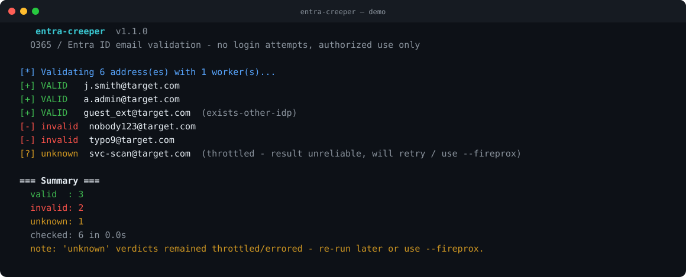

# entra-creeper

[](https://github.com/xcoy0te/entra-creeper/actions/workflows/ci.yml)

A modernized, **dependency-free** successor to [LMGsec/o365creeper](https://github.com/LMGsec/o365creeper) for validating Office 365 / Microsoft Entra ID email addresses.

It confirms whether an email address maps to a real Microsoft account by inspecting the **unauthenticated** `GetCredentialType` response. It **never submits a password**, so it does not create sign-in log entries or trip Smart Lockout.

## Demo



*Note: `guest_ext@` is reported valid via `exists-other-idp` (IfExistsResult 5), which the original o365creeper misses, and the throttled address is held as `unknown` rather than guessed.*

---

## Why this over the original?

The original o365creeper is a great, simple tool. `entra-creeper` keeps its spirit (and its `-e`/`-f`/`-o` interface) while fixing real limitations:

| | original o365creeper | **entra-creeper** |
|---|---|---|
| Speed | one request at a time | concurrent worker pool (`-w`) |
| Validity logic | only `IfExistsResult == 0` | `0`, `5` (other Microsoft IDP) **and** `6` (both IDPs) — **fewer false negatives** |
| Throttling | not handled → false positives | **adaptive shared cooldown** — all workers pause together on throttle, honoring `Retry-After` |
| Result recovery | none | **automatic retry pass** re-checks throttled `unknown` addresses so the final answer is clean |
| Input hygiene | — | malformed lines skipped (not wasted as requests) |
| Tenant awareness | none | optional `getuserrealm` pre-check: **skips non‑Microsoft domains** and **warns on federated domains** where results are unreliable |
| Dependencies | `requests` | **none** — Python 3.7+ standard library only |
| Output | plaintext | plaintext (compatible) **+ JSON + CSV** with per-result metadata |
| OPSEC | proxy | User-Agent rotation, request delay/jitter, **proxy rotation**, **FireProx** endpoint support |
| Robustness | — | resume, stdin input, graceful Ctrl‑C, live summary |

### The correctness details that matter

- **`IfExistsResult` codes.** `0` = exists, `1` = does not exist, `2` = throttled, `4` = error, `5` = exists in another Microsoft IDP, `6` = exists in both IDPs. Treating only `0` as valid silently drops real accounts that return `5`/`6`.
- **Throttling causes false positives.** After repeated requests, Microsoft randomly sets `ThrottleStatus`, which can make invalid addresses look valid. `entra-creeper` treats a throttled response as `unknown` and retries with back-off rather than recording a guess. Use `--fireprox` or `--proxy-file` to distribute source IPs at scale.
- **Federated domains lie.** On domains federated to a third-party IdP, `GetCredentialType` frequently returns "exists" for *every* address. `--check-domains` flags these so you don't trust the output blindly.

### How it stays accurate under load

Validating a large list is a fight with Microsoft's throttling, and naive tools lose it — once throttled, responses become unreliable and invalid addresses can read as valid. `entra-creeper` handles this in three layers:

1. **Adaptive shared cooldown** (`--cooldown`, default 5s). The moment any worker sees a throttle signal (`ThrottleStatus`, `IfExistsResult` 2, HTTP 429, or a `Retry-After` header), *every* worker pauses together and backs off exponentially. Throttling stops snowballing instead of accelerating.
2. **Per-address retries** (`--throttle-retries`, default 3) for transient throttles/errors.
3. **A final retry pass** (`--retry-pass`, default 1) that re-checks only the addresses still `unknown` due to throttling, after a cooldown — so a throttled blip doesn't cost you a real result. Anything still `unknown` at the end is reported honestly as `unknown`, never guessed.

For very large lists, combine with `--fireprox` or `--proxy-file` to spread requests across source IPs and avoid throttling in the first place.

---

## Install

```bash
git clone https://github.com/xcoy0te/entra-creeper.git
cd entra-creeper
python3 entra-creeper.py -h
```

No `pip install` required. Python 3.7+.

## Usage

```bash
# Single address
python3 entra-creeper.py -e john.doe@target.com

# A list, 20 workers, gentle pacing, valid addresses saved
python3 entra-creeper.py -f emails.txt -o valid.txt -w 20 --delay 0.3 --jitter 0.4

# Pipe from stdin, pre-check domains, full JSON report
cat emails.txt | python3 entra-creeper.py --check-domains --json results.json

# Rotate proxies + User-Agents
python3 entra-creeper.py -f emails.txt --proxy-file proxies.txt --random-agent

# Front the API with FireProx to rotate source IPs and dodge throttling
python3 entra-creeper.py -f emails.txt \
    --fireprox https://abc123.execute-api.us-east-1.amazonaws.com/fireprox

# Resume an interrupted run (skips addresses already in valid.txt)
python3 entra-creeper.py -f emails.txt -o valid.txt --resume
```

### Options

- **Input:** `-e/--email`, `-f/--file`, `--stdin`
- **Output:** `-o/--output` (streamed plaintext), `--json`, `--csv`, `--resume`, `-q/--quiet`, `-v/--verbose`
- **Network/OPSEC:** `-w/--workers`, `-t/--timeout`, `--delay`, `--jitter`, `--throttle-retries`, `--retry-pass`, `--cooldown`, `--proxy`, `--proxy-file`, `--fireprox`, `--user-agent`, `--random-agent`, `--insecure`
- **Enrichment:** `--check-domains`

Run `python3 entra-creeper.py -h` for the full list.

## Output formats

- **Plaintext (`-o`)** — one valid address per line, appended and flushed as found (crash-safe, `--resume`-friendly). Drop-in compatible with the original.
- **JSON (`--json`)** / **CSV (`--csv`)** — every address with `verdict`, `ifexists_code`, `meaning`, `throttled`, `federated`, and a `note`.

`-q/--quiet` prints only valid addresses to stdout, so it pipes cleanly into other tools.

## How it works

For each address it POSTs `{"username": "<email>", "isOtherIdpSupported": true}` to
`https://login.microsoftonline.com/common/GetCredentialType` and classifies the `IfExistsResult`
field. With `--check-domains` it first queries `getuserrealm.srf` per domain to learn whether the
domain is a Microsoft tenant (`Managed`/`Federated`) or not (`Unknown`), skipping the former's dead
domains and flagging federated ones.

## Responsible use

This tool performs account *validation*, not authentication — no credentials are sent and no
lockouts are triggered. It exists for authorized penetration testing, red-team engagements, and
security research. Enumerating accounts you have no permission to test may be illegal in your
jurisdiction and typically violates provider terms. Get written authorization first.

## Development

Zero runtime dependencies. Tests are pure-stdlib and fully offline (network is mocked):

```bash
python3 -m unittest discover -s tests -v
```

CI runs byte-compile + tests on Python 3.7 / 3.9 / 3.12.

## Credits

- Original concept: [LMGsec/o365creeper](https://github.com/LMGsec/o365creeper).
- `IfExistsResult` / realm behavior documented by [gremwell/o365enum](https://github.com/gremwell/o365enum) and [AADInternals](https://aadinternals.com/post/desktopsso/).

## License

MIT — see [LICENSE](LICENSE).
